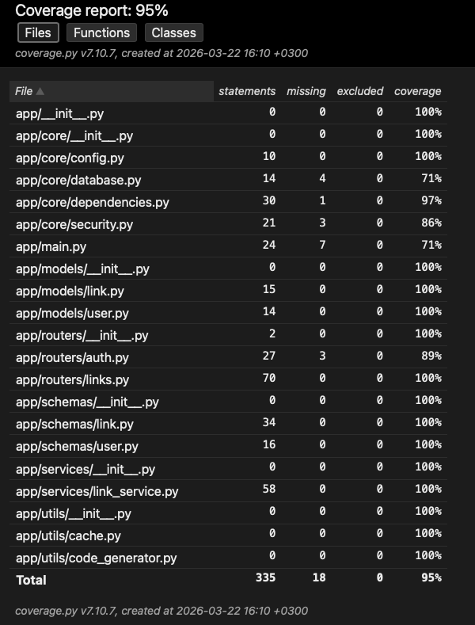
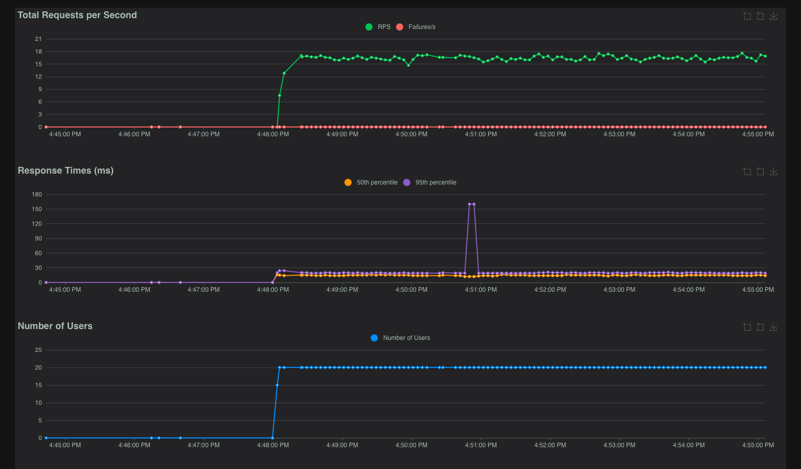

Сервис для управления ссылками, который позволяет:
- создавать / удалять / изменять / получать информацию по короткой ссылке. 
- получать статистку
- создавать кастомные ссылки
- поиск ссылок по оригинальному url
- указание времени жизни ссылки
- удаление неиспользуемых ссылок

POST /links/shorten
request {
  "original_url": "https://example.com/",
  "expires_at": "2026-03-15T20:36:09.908Z",
  "custom_alias": "string"
}

response
{
  "original_url": "https://example.com/",
  "expires_at": "2026-03-15T20:36:09.908000Z",
  "id": 3,
  "short_code": "string",
  "created_at": "2026-03-15T20:36:11.645352Z",
  "clicks": 0,
  "last_used_at": null,
  "user_id": null
}

GET links/search
request
https://example.com/
response
[
  {
    "short_code": "string",
    "short_url": "https://python-project-3-saa3.onrender.com/links/string",
    "created_at": "2026-03-15T20:36:11.645352Z"
  }
]

GET /links/{short_code}/stats
request string
response
{
  "short_code": "string",
  "original_url": "https://example.com/",
  "created_at": "2026-03-15T20:36:11.645352Z",
  "clicks": 0,
  "last_used_at": null,
  "expires_at": "2026-03-15T20:36:09.908000Z"
}

PUT /links/{short_code}
request 
{
  "original_url": "https://example.com/"
}

response
{
  "original_url": "https://example.com/",
  "expires_at": "2026-03-15T20:48:32.312Z",
  "id": 0,
  "short_code": "string",
  "created_at": "2026-03-15T20:48:32.312Z",
  "clicks": 0,
  "last_used_at": "2026-03-15T20:48:32.312Z",
  "user_id": 0
}

Инструкция по запуску:
локально:
- склонировать репозиторий
- создать файл .env
POSTGRES_USER=postgres
POSTGRES_PASSWORD=123456
POSTGRES_DB=postgres
SECRET_KEY
UNUSED_LINK_DAYS=30
BASE_URL=http://localhost:8000
- запустить в терминале docker compose up
- перейти по ссылке http://localhost:8000/docs

через render - по ссылке https://python-project-3-saa3.onrender.com

## Запуск тестов

1) Установить зависимости
2) docker-compose up -d postgres
3) alembic upgrade head
4) pytest tests/ -v --cov=app --cov-report=term-missing --cov-report=html
5) Открыть в браузере htmlcov/index.html

Файл с отчетом содержится в папке htmlcov

